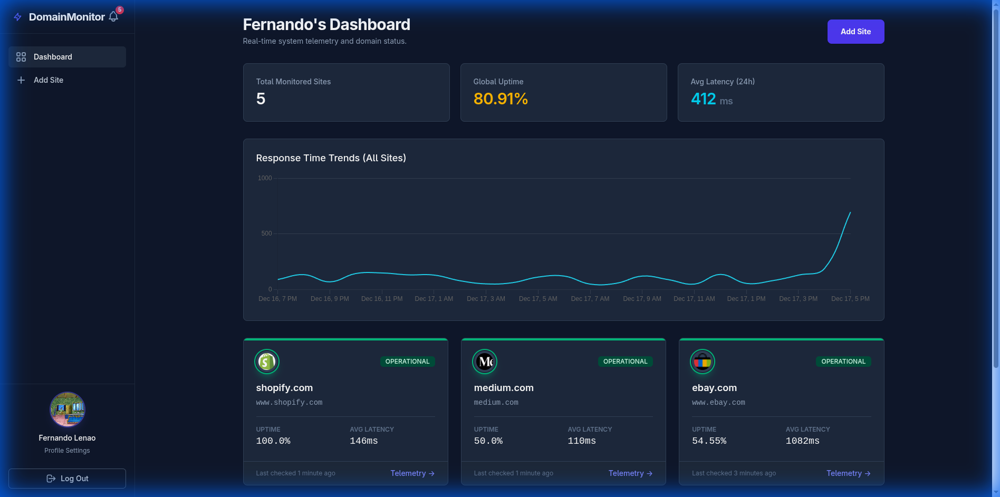
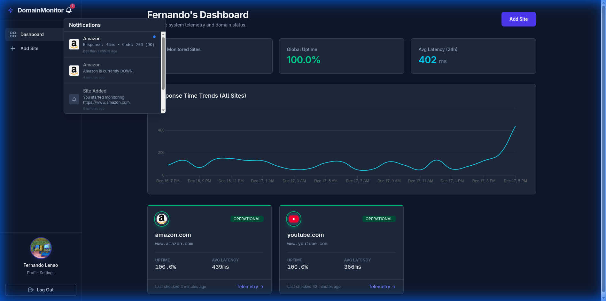
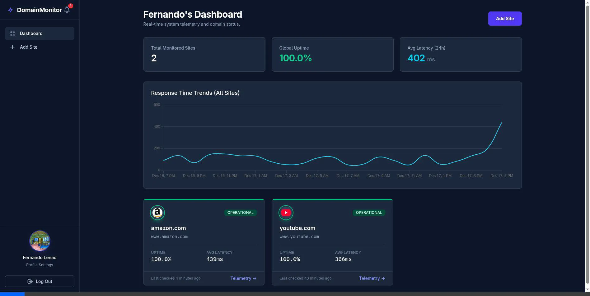
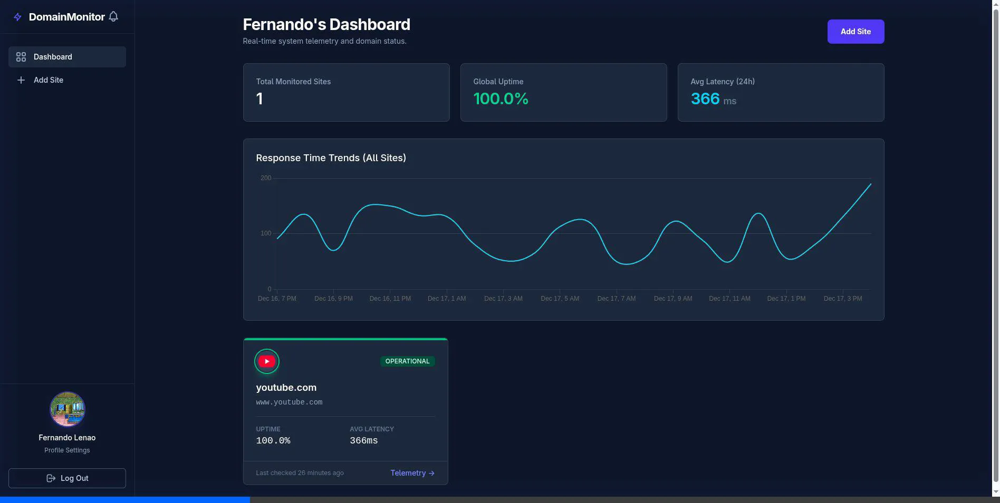

# 🌐 Domain Monitor

**Domain Monitor** is a professional-grade, real-time website monitoring platform designed for developers and system administrators. It offers instant downtime alerts, detailed telemetry tracking, and a sleek, dark-mode dashboard.

<div align="center">
  
</div>

## ✨ Key Features

- **🚀 Real-Time Monitoring**: Automatically checks your sites at configurable intervals (down to 1 minute).
- **🔔 Smart Notifications**:
  - **In-App**: Real-time dropdown with "Rich Stats" (Response Time, Status Code).
  - **Email**: Instant alerts for Downtime and Recovery (`DowntimeMailer`).
  - **Favicon Integration**: Auto-fetches logos for a polished look.
  - **Live Updates**: User Turbo Streams for instant UI updates without refreshing.
- **📊 Advanced Analytics**:
  - Visual Response Time Charts (Chart.js).
  - Uptime Percentage & Average Latency calculations.
- **🛡️ Bot Protection Bypass**: Uses advanced headers to request sites like a real Chrome browser, preventing false positives (e.g., eBay, Medium).
- **🎨 Premium UI/UX**:
  - "Sexy" Dark Mode logic.
  - Responsive Sidebar layout.
  - Click-to-toggle menus and interactive elements.
- **🧩 Browser Extension**: Includes a Chrome Extension for quick status checks (source in `/extension`).

<div align="center">
  <h3>Rich Notifications</h3>
  
</div>

## 🛠️ Technology Stack

- **Backend**: Ruby on Rails 8.1
- **Database**: SQLite (Production-ready with WAL mode)
- **Frontend**: Tailwind CSS, Stimulus.js, Turbo
- **Jobs**: ActiveJob (Async monitoring)
- **Visuals**: Chartkick / Chart.js

## 🚀 Getting Started

### Prerequisites

- Ruby 3.2+
- Rails 8+
- Node.js & Yarn

### Installation

1.  **Clone the repository**:

    ```bash
    git clone https://github.com/Fernandoleano/domain-monitor.git
    cd domain-monitor
    ```

2.  **Install dependencies**:

    ```bash
    bundle install
    yarn install
    ```

3.  **Setup Database**:

    ```bash
    bin/rails db:prepare
    ```

4.  **Start the server**:
    ```bash
    bin/dev
    ```
    Visit `http://localhost:3000` 🚀

## 🧪 How It Works

### Background Monitoring

The `UrlCheckerJob` runs in the background. It mimics a real user:

```ruby
# Mimics Chrome to avoid 403 Forbidden errors
request["User-Agent"] = "Mozilla/5.0 ... Chrome/120.0..."
```

It handles redirects and specific HTTP codes (403/429) intelligently to ensure accuracy.

### Notification System

When a site goes down, a notification is created with rich telemetry data:

```ruby
params: {
  stats: "Response: 500ms • Code: 500"
}
```

This is broadcasted via Turbo Streams to the user's bell icon instantly.

<div align="center">
  <h3>Live Notification Demo</h3>
  
</div>

## 📸 Screenshots

| Dashboard                                           | App Overview                                            |
| --------------------------------------------------- | ------------------------------------------------------- |
|  |  |

## 🤝 Contributing

1.  Fork the Project
2.  Create your Feature Branch (`git checkout -b feature/AmazingFeature`)
3.  Commit your Changes (`git commit -m 'Add some AmazingFeature'`)
4.  Push to the Branch (`git push origin feature/AmazingFeature`)
5.  Open a Pull Request

## 📄 License

Distributed under the MIT License.
